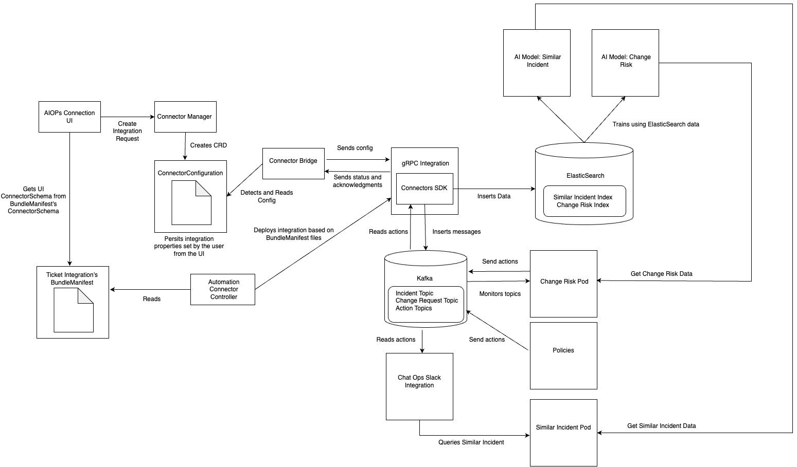

# Github Integration Template

The github connector template is a snapshot of the AIOPS github integration. It has been renamed as `github-grpc-connector-template` so it can be installed with the existing `github` integration.

A quick start guide to understand the changes done to the github integration can be done by comparing branches:
https://github.com/IBM/cp4aiops-connectors-ticket-template/compare/github-connector-sample?expand=1

For a quick start to begin development, see the explanation via: https://github.com/IBM/cp4aiops-connectors-ticket-template/blob/github-connector-sample/InstallGithubTemplate.md

## Architecture

Note: all pod names are prefixes, OpenShift and the conenctor framework deployments will add suffixes to make them unique

**AIOPs Connection UI**

Pod Name: `aiops-connections-ui`

Description: the UI when creating integrations for the user. The UI is responsible for sending information that the user fills in and passing it to the connector manager, which will persist this data.
Data flow: 
- AIOPs connection UI -> Connector Manager is done via REST
- AIOps connection UI -> ConnectorSchema queried with Kubernetes calls

**Connector Manager**

Pod Name: `connector-manager`

Description: responsible for persisting data about the connector as well as a REST endpoint for UI and some actions
Data flow: 
- user's integration information stored as `ConnectorConfiguration` via Kubernetes calls
- REST calls from other services

**ConnectorConfiguration**

Description: this custom resource definition is stored as `ConnectorConfiguration` and persists the integration's properties set by the user from the UI

**Connector Bridge**

Pod Name: `connector-bridge`

Description: the bridge is the gRPC server used to communicate with the integrations. This connector framework builds a gRPC client and the communication between the bridge and the connector you're writing is via gRPC
Data flow:
- Once a gRPC connection is established between communication happens via gRPC

**gRPC Integration**

Pod Name: depends on how the user defines this in the `ConnectorSchema` from the `BundleManifest`

Description: the integration that the developer creates. This template provides an example of how to call the APIs to help develop your own ticket connector. The integration uses the Connectors SDK to communicate with the connector bridge.

**Connectors SDK**

Description: The connectors SDK abstracts away a lot of the logic for securely connecting to the gRPC server and communicating with it. In the local scenario (i.e. the integration runs on the cluster), there are also APIs to insert data directly into Kafka and Elastic.

**Policies**

Pod Name: `ir-lifecycle-operator-controller-manager`

Description: The Lifecycle pod can interact with the integration
- Actions to the integration sent via the Kafka topic: `cp4waiops-cartridge.lifecycle.output.connector-requests`
- Actions received by the integration sent via the Kafka topic: `cp4waiops-cartridge.lifecycle.input.connector-responses`

**Change Risk Pod**

Pod Name: `aimanager-aio-change-risk`

Description: requires Change Risk AI model to be trained. Actions can be sent via `cp4waiops-cartridge.snow-handlers` to the integration.

**Similar Incident Pod**

Pod Name: `aimanager-aio-similar-incidents-service`

Description: requires Similar Incident AI model to be trained. The Chat Ops Slack integration can query it for Similar Incident data.

**Chat Ops Slack Integration**

Pod Name: `aimanager-aio-chatops-orchestrator`

Description: the policy tells Chat Ops to create a Slack message. This Slack message has details to call Similar Incident.

**Kafka**
See Kafka in Async messaging.

**Elastic**

Description: training the Change Risk and Similar Incident AI models. When the integration writes directly into Elastic, the affected indices are:
1. `snowincident` - for training incident data
2. `snowchangerequest` for training change requests

_Overview of involved components/microservices - pictures please, and short descriptions what the individual services do_

### Components and features affected

Not applicable, this template is not installed in CP4AIOps. It exists as an example on the open source for other developers to create an integration.

### Data Schemas

No new Data Schemas are used, just takes advantage of the existing data schemas for the connector framework, change risk, similiar incident, and policies.

### APIs

The Connectors SDK had some new APIs added to support the ticket scenario:

Class: `com.ibm.cp4waiops.connectors.sdk.TicketAction`
Performs actions related to Tickets
- `emitIncident`: emits the Ticket into the incident Kafka topic
- `emitChangeRequest`: emits Ticket into the change request Kafka topic
- `insertIncidentIntoElastic`: inserts Similar Incident Ticket data into Elastic for AI training
- `insertChangeRequestIntoElastic`: inserts Change Risk Ticket data into Elastic for AI training

### Async messaging

**Kafka**
Consume topics: 
- `cp4waiops-cartridge.lifecycle.output.connector-requests`
- `cp4waiops-cartridge.connector-snow-actions`
- `cp4waiops-cartridge.snow-handlers` 

Produce topics: 
- `cp4waiops-cartridge.lifecycle.input.events`
- `cp4waiops-cartridge.lifecycle.input.connector-responses`
- `cp4waiops-cartridge.connector-snow-actions`
- `cp4waiops-cartridge.changerequest`
- `cp4waiops-cartridge.incident`
- `cp4waiops-cartridge.itsmincidentresponse`

