# Ticket Integration Template
This generic ticket template generates dummy data that can train Similar Incident and Change Risk AI models.

A quick start guide to customizing the connector name, building the image, and running compare the branches via: https://github.com/IBM/cp4aiops-connectors-ticket-template/compare/sample01?expand=1

For a quick start to begin development, see the explanation via: https://github.com/IBM/cp4waiops-connectors-java-template/blob/main/SampleSetup.md

## Architecture


Note: all pod names are prefixes, OpenShift and the conenctor framework deployments will add suffixes to make them unique

**AIOPs Connection UI**

Pod Name: `aiops-connections-ui`

Description: the UI when creating integrations for the user. The UI is responsible for sending information that the user fills in and passing it to the connector manager, which will persist this data.
Data flow: 
- AIOPs connection UI -> Connector Manager is done via REST
- AIOps connection UI -> ConnectorSchema queried with Kubernetes calls

**Connector Manager**

Pod Name: `connector-manager`

Description: responsible for persisting data about the connector as well as a REST endpoint for UI and some actions
Data flow: 
- user's integration information stored as `ConnectorConfiguration` via Kubernetes calls
- REST calls from other services

**ConnectorConfiguration**

Description: this custom resource definition is stored as `ConnectorConfiguration` and persists the integration's properties set by the user from the UI

**Connector Bridge**

Pod Name: `connector-bridge`

Description: the bridge is the gRPC server used to communicate with the integrations. This connector framework builds a gRPC client and the communication between the bridge and the connector you're writing is via gRPC
Data flow:
- Once a gRPC connection is established between communication happens via gRPC

**gRPC Integration**

Pod Name: depends on how the user defines this in the `ConnectorSchema` from the `BundleManifest`

Description: the integration that the developer creates. This template provides an example of how to call the APIs to help develop your own ticket connector. The integration uses the Connectors SDK to communicate with the connector bridge.

**Connectors SDK**

Description: The connectors SDK abstracts away a lot of the logic for securely connecting to the gRPC server and communicating with it. In the local scenario (i.e. the integration runs on the cluster), there are also APIs to insert data directly into Kafka and Elastic.

**Policies**

Pod Name: `ir-lifecycle-operator-controller-manager`

Description: The Lifecycle pod can interact with the integration
- Actions to the integration sent via the Kafka topic: `cp4waiops-cartridge.lifecycle.output.connector-requests`
- Actions received by the integration sent via the Kafka topic: `cp4waiops-cartridge.lifecycle.input.connector-responses`

**Change Risk Pod**

Pod Name: `aimanager-aio-change-risk`

Description: requires Change Risk AI model to be trained. Actions can be sent via `cp4waiops-cartridge.snow-handlers` to the integration.

**Similar Incident Pod**

Pod Name: `aimanager-aio-similar-incidents-service`

Description: requires Similar Incident AI model to be trained. The Chat Ops Slack integration can query it for Similar Incident data.


**Chat Ops Slack Integration**

Pod Name: `aimanager-aio-chatops-orchestrator`

Description: the policy tells Chat Ops to create a Slack message. This Slack message has details to call Similar Incident.

**Kafka**
See Kafka in Async messaging.

**Elastic**

Description: training the Change Risk and Similar Incident AI models. When the integration writes directly into Elastic, the affected indices are:
1. `snowincident` - for training incident data
2. `snowchangerequest` for training change requests

_Overview of involved components/microservices - pictures please, and short descriptions what the individual services do_

### Components and features affected

Not applicable, this template is not installed in CP4AIOps. It exists as an example on the open source for other developers to create an integration.

### Data Schemas

No new Data Schemas are used, just takes advantage of the existing data schemas for the connector framework, change risk, similiar incident, and policies.

### APIs

The Connectors SDK had some new APIs added to support the ticket scenario:

Class: `com.ibm.cp4waiops.connectors.sdk.TicketAction`
Performs actions related to Tickets
- `emitIncident`: emits the Ticket into the incident Kafka topic
- `emitChangeRequest`: emits Ticket into the change request Kafka topic
- `insertIncidentIntoElastic`: inserts Similar Incident Ticket data into Elastic for AI training
- `insertChangeRequestIntoElastic`: inserts Change Risk Ticket data into Elastic for AI training

### Async messaging

**Kafka**
Consume topics: 
- `cp4waiops-cartridge.lifecycle.output.connector-requests`
- `cp4waiops-cartridge.connector-snow-actions`
- `cp4waiops-cartridge.snow-handlers` 

Produce topics: 
- `cp4waiops-cartridge.lifecycle.input.events`
- `cp4waiops-cartridge.lifecycle.input.connector-responses`
- `cp4waiops-cartridge.connector-snow-actions`
- `cp4waiops-cartridge.changerequest`
- `cp4waiops-cartridge.incident`
- `cp4waiops-cartridge.itsmincidentresponse`

## Demo
This connector can be run as an end-to-end demo to show developers what interactions they can have with tickets in CP4AIOPs

### Installing The Ticket Template Integration
On your OpenShift console, first setup the secret to pull the `BundleManifest`'s files.

The [BundleManifest](bundlemanifest.yaml) has a GitHub pull secret defined there called `test-utilities-github-token`. You need to create a value/key secret:
```bash
oc create secret generic test-utilities-github-token --from-literal=username=<GITHUB_USERNAME> --from-literal=password=<GITHUB_TOKEN>
```

Then run:
```bash
oc apply -f bundlemanifest.yaml
```

Ensure the deployed BundleManifest is in a running state:
```bash
oc get bundlemanifest | grep ticket-template
ticket-template                 Configured
```

The UI may take 5-10 minutes to refresh, to show the newly added integration.

You can force a refresh by deleting the `connections-ui` pod:
```bash
oc get pods | grep connections-ui
aiops-connections-ui-6ccf9c94f-2j2jm                              1/1     Running     0               63m

oc delete pod aiops-connections-ui-6ccf9c94f-2j2jm
pod "aiops-connections-ui-6ccf9c94f-2j2jm" deleted

oc get pods | grep connections-ui
aiops-connections-ui-6ccf9c94f-l9gqd                              1/1     Running             0               27s
```

### Create The Ticket Template Integration


Search for `ticket` to add your newly added integration.

You can fill in any valid data. The values here don't affect the dummy data being generated, it is to show what fields are commonly used and to show that this configuration can be loaded properly by the connector.

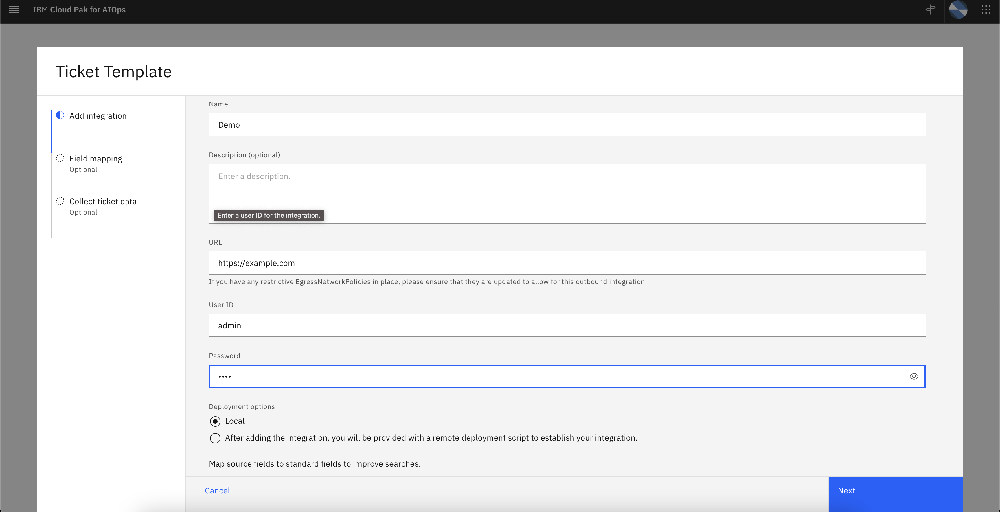
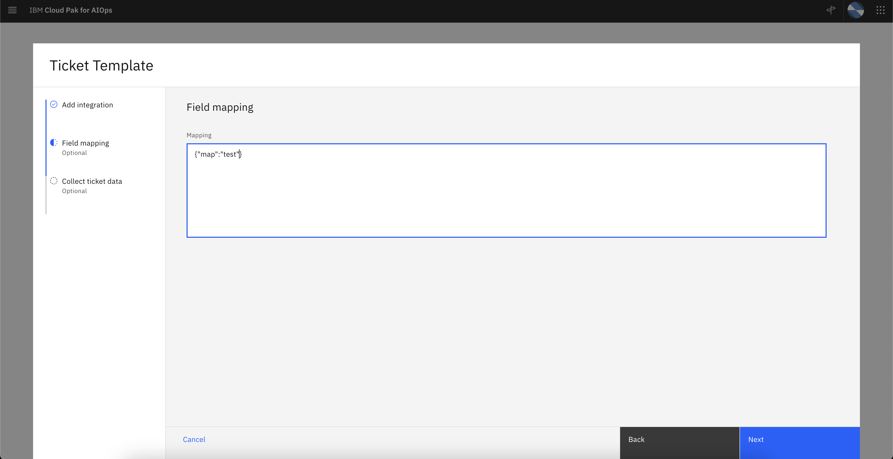
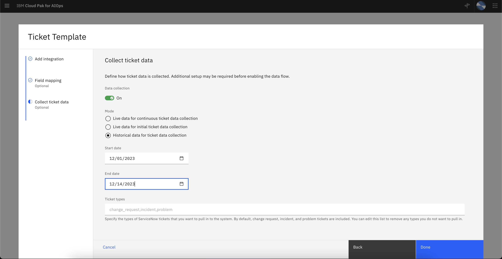

Press `Done` (Note: there is a bug where the dialog doesn't go away, this needs to be investigated)

### Alerts and Incident Creation
An alert will be generated, this alert will show up in the CPAIOps UI:
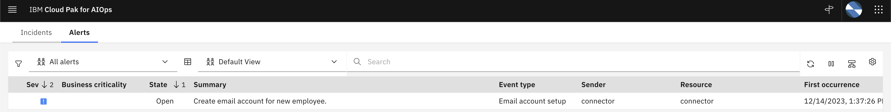

If you click on the alert and the Raw details, you can see all the information related to this alert.
For exampe, the `classification` for `Email account setup`

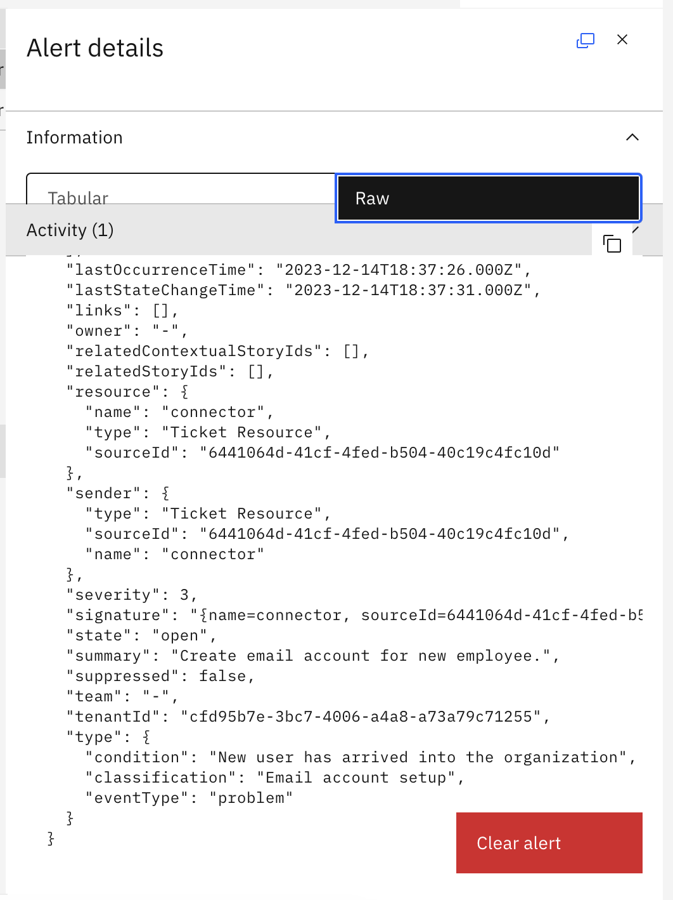

To create a policy that will create an incident based on the classification, go to the automations page, click `Create policy`


Choose `Promote alerts to an incident`

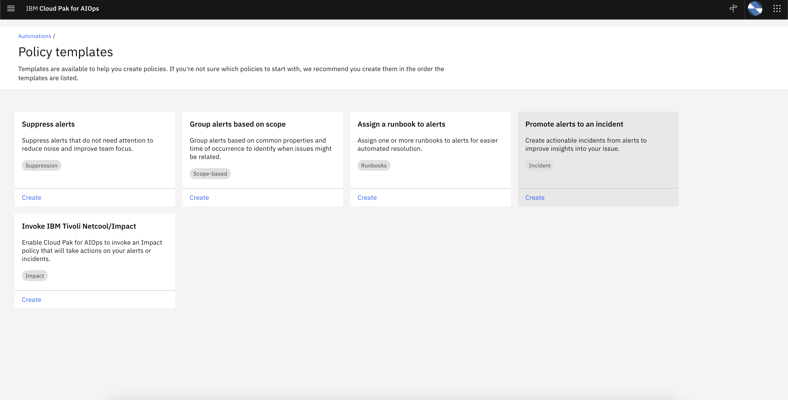

Fill in a name


Make sure you set the event count increasing as a reason to generate an incident. Otherwise you need to modify the code to generate a new alert

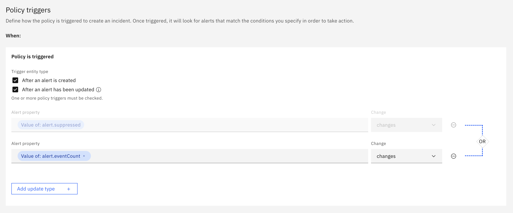

Add the condition to check for the `classification`

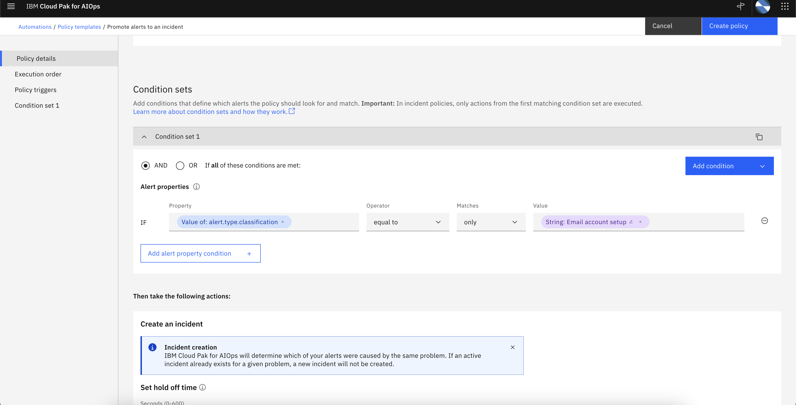

Choose "Notify users in an existing ChatOps channel" and "Notify users via email" and choose your integration's name. In 4.3, there is a limitation in the UI where it doesn't show the integration. This will be fixed in the UI in the future. For now, sending via email doesn't actually send an email, it is used to send the `onAction` event back to the ticket integration.

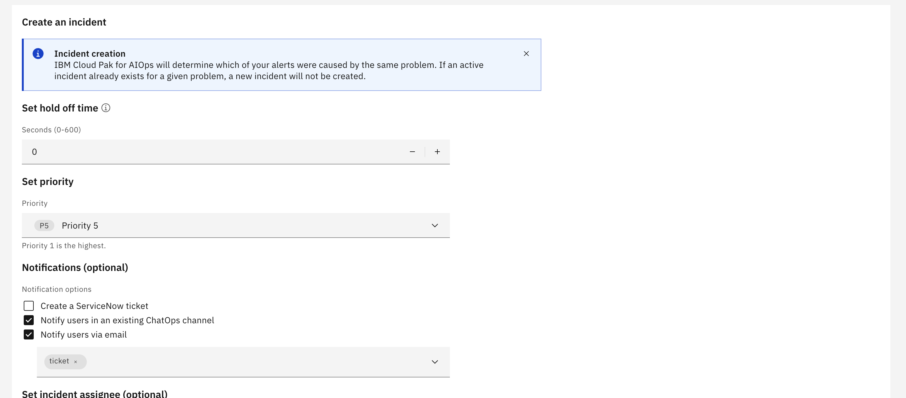

To trigger the incident, restart your pod. Since that will generate one alert on startup, that will trigger an incident to be created based on our policy.

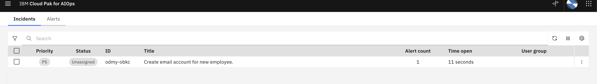

If you click on the Incident, you will see details about the Incident. This includes link to the policy that created this incident, the link to that incident (note: a current limitation includes "ServiceNow" as a prefix and will be fixed in the future), and the Slack channel.

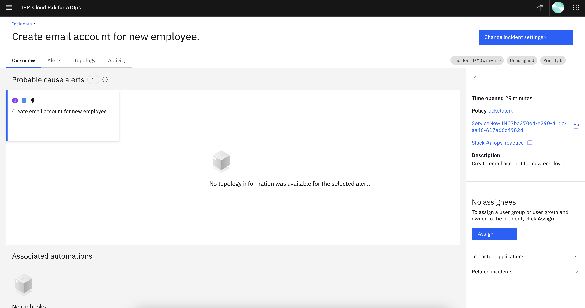

### Setup Slack Integration for Similar Incident
Documentation on how to setup Slack integration can be found here: https://www.ibm.com/docs/en/cloud-paks/cloud-pak-aiops/4.3.0?topic=connection-configuring-slack

Once the Slack integration is established, your Proactive channel will allow you to try out similiar incident.

When running the example, an incident will be created (to reset this, set the incident state to resolved so the Slack message will be re-generated).

An example of a Slack message (a current limitation shows ServiceNow in the UI, this will be fixed in the future):
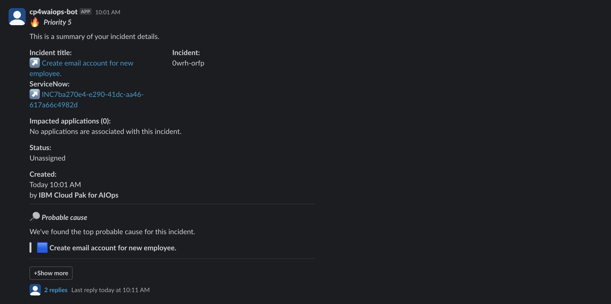

Clicking `+Show more` and `Search past tickets` will let you choose past incidents using the Similiar Incident functionality.
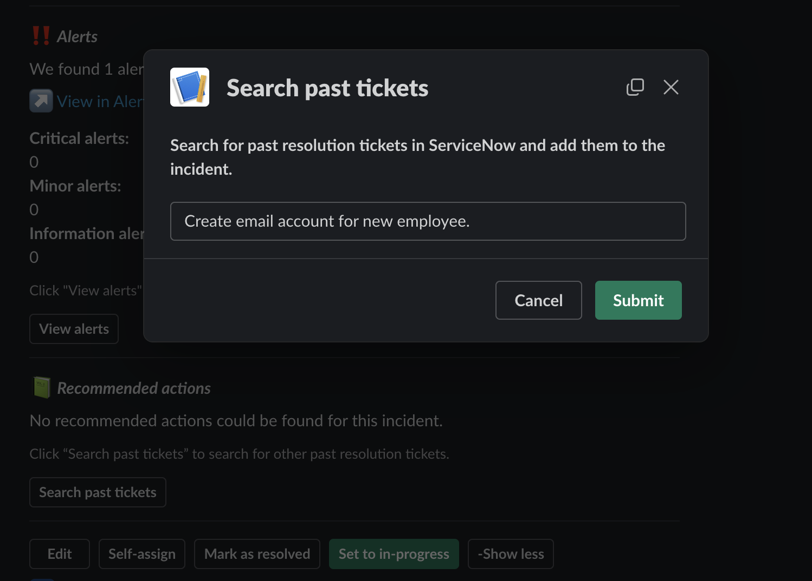

When searching, you can find other incident with the corresponding link
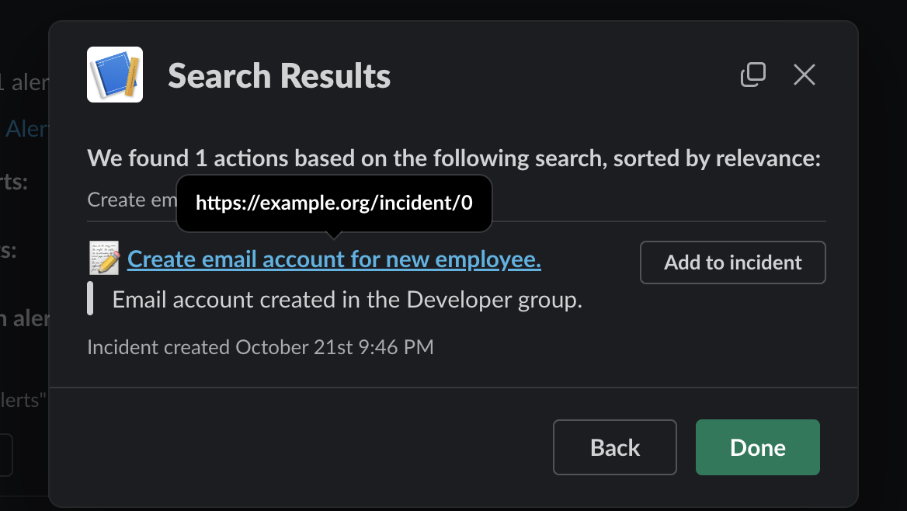

### Train the AI for Similar Incident and Change Risk
Go to the AI management page

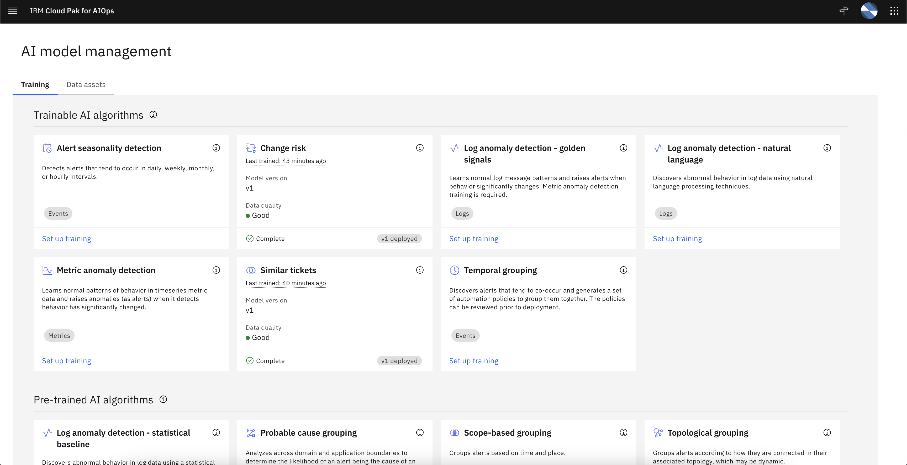

Click on Similiar Incident. Go through the wizard with the defaults. Then precheck the data, train models, and deploy. There should be no errors.
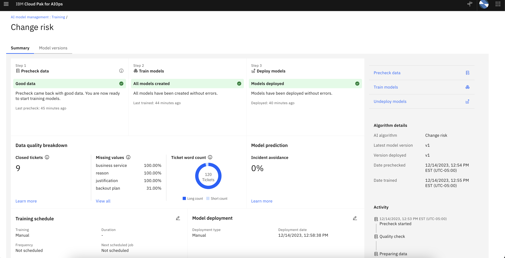

Click on Change Risk. Go through the wizard with the defaults. Then precheck the data, train models, and deploy. There should be no errors.
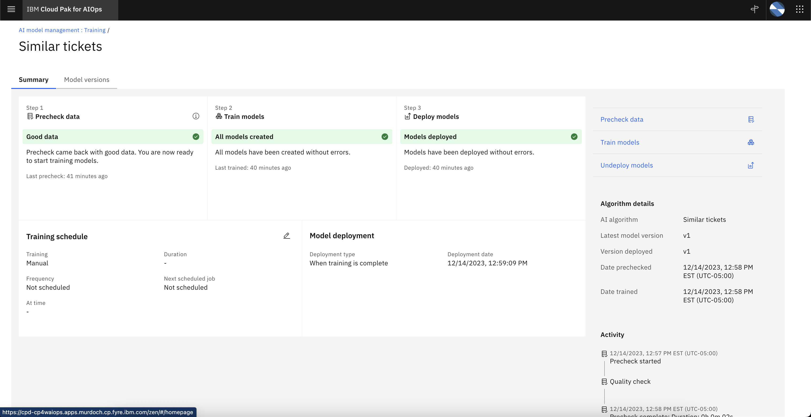

### What Data Is Generated 
1. An alert is generated
2. Incident data is generated, this will allow you to train the Similar Incident. This data would simulate a historical pull of data for training.
3. Change request data is generated, this will allow you to train Change Risk. This data would simulate a historical pull of data for training.
4. One change request to trigger a change risk assessment

When Change Risk AI management is deployed, when running the integration, you will see the message indicating that an action had occurred:
```
onAction with type=com.ibm.sdlc.snow.comment.create and data={"specversion":"1.0","id":"18a918c7b0d74c00aaad613938375a39","source":"change-risk-service","type":"com.ibm.sdlc.snow.comment.create","datacontenttype":"application/json","dataschema":"","subject":"","time":"2023-12-14T21:13:48.507862Z","connectionid":"f7b18f95-7919-4681-8ae0-ab3ac981c5dc","componentname":"connector","data":{"connection_id":"f7b18f95-7919-4681-8ae0-ab3ac981c5dc","sys_id":"syside2bfddc8-d2cd-46d5-a793-9ed5cc568743","id":"98da1a2e-b5c3-49fc-8b0c-9e2c05ec3a6a","number":"numbere2bfddc8-d2cd-46d5-a793-9ed5cc568743","action":"CREATE","kind":"change_request","created_by":"created_user0","assigned_to":"assigned_user0","score":0.46692,"prediction_confidence":0.91131,"label":false,"hyperlink":"https://ticket template URL/change_request.do?sysparm_query=number=numbere2bfddc8-d2cd-46d5-a793-9ed5cc568743","explanation_words":{},"explanation":{"related_tickets":[]},"body":"IBM Cloud Pak for Watson AIOps does not classify this as a high risk change. It might be due to lack of evidence or evidence exhibit no risk. \n\n Confidence: [code]<b>91%</b>[/code] \n\n "}}
```


## Files
- `bundle-artifacts` folder: contains the yaml files for deploying to Kubernetes
- `bundlemanifest.yaml`: the file used to install the connector into CP4AIOps
- `src/main`: the Java files for the integration. This integration is built using Liberty and Maven
- `src/test`: example Java JUnit files

### Configuration

Example (lots of metadata removed):
```yaml
apiVersion: connectors.aiops.ibm.com/v1beta1
kind: ConnectorConfiguration
metadata:
  name: 31fbffb5-2ab3-4e49-93b9-aa8fec980763
  uid: a08f9aa8-c4f7-4a80-8cc4-a3be82398384
  namespace: cp4waiops
spec:
  config:
    collection_mode: historical
    data_flow: true
    end: 1701907199999
    mapping:
      field: mapping
      field2: mapping2
    password: pass
    start: 1701388800000
    url: 'https://example.com'
    username: admin
    types: change_request
  deploymentType: microedge
  type: ticket-template
```

- If `types` is missing, that means ALL types of tickets should be obtained
- Description is not passed through the 


## Local Development

In order to train the AI, you must enable the direct to elastic functionality. If you are testing locally on your machine, you must do port forwarding.

First, login to OpenShift and go to the namespace where CP4AIOps is installed into.

```bash
export EL_USER=`oc get secret iaf-system-elasticsearch-es-default-user -o go-template --template="{{.data.username|base64decode}}"`
export EL_PWD=`oc get secret iaf-system-elasticsearch-es-default-user -o go-template --template="{{.data.password|base64decode}}"`
echo $EL_USER
echo $EL_PWD
kubectl port-forward iaf-system-elasticsearch-es-aiops-0 9200:9200
```

Create the folder `elastic` in the root directory. Create the `hostname`, `password`, `port`, and `username` files. 

```bash
export SERVICE_BINDING_ROOT=<root directory>; mvn liberty:run
```

## Question and Answer

1. How should I get started?
For customizing your integration, a very detailed example of customizing a integration can be found in another sample: https://github.com/IBM/cp4waiops-connectors-java-template/blob/main/SampleSetup.md. The same concepts apply to this integration.

In `TicketConnector`'s class, the `onAction` and `onConfiguration` are the two methods you should start with.

`onConfiguration` reads the properties set by the user from the AIOPs UI. Your incident management system (ITSM) may require URL and a token, which you need to read from here.

After reading these properties, for "live" data, that means you're continuously monitoring your ITSM for new incidents or change requests. I would recomend you create a polling mechanism to periodically poll your source for udpated tickets since you last checked.

For "historical" data, you want to query the date range specified by the user. You can make a call to your ITSM system to grab data in bulk. You should use paging and offsets to query a subset of data at a time. If you query all the data at once, there is potential for OutOfMemory errors in this integration.

`onAction` deals with actions from AIOps. The two common ones are incident creation and adding change risk. An example is provided for `onAction` to help you get started. Once you get the action, you need to call your ITSM system's API to take actions.

2. Why don't we use the Flink framework like the Service Now connector? The Flink framework hard codes Service Now as the connector type. This means any new connector created for ticketing cannot use it. As a result, data is inserted directly into elastic and Flink isn't used. The batching used in Flink for increasing performance was copied

3. Why `connection_config.data_flow_ticket` instead of `connection_config.data_flow`? `connection_config.data_flow` is a special property in the AIOPs UI that tries to start a Flink job. For the ticket connectors, it will bypass the Flink job and insert directly into elastic, so this property cannot be used.

4. How should I get new data from the data source? Due to limitations with FIPs in combination with Liberty and gRPC, the ticket connectors should get live and inference data by polling the data source. If you set setup a webhook, that requires an incoming connection, which is not FIPs compliant. FIPs compliance was enforced by only allowing outgoing connections.

5. How do I reset AI training?
First delete the AI models for Similar Incident or Change Risk
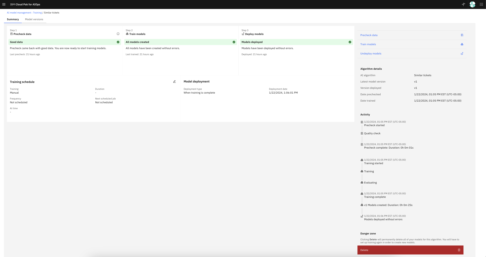
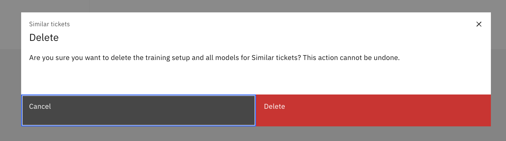

In one terminal run:

```bash
export EL_USER=`oc get secret iaf-system-elasticsearch-es-default-user -o go-template --template="{{.data.username|base64decode}}"`
export EL_PWD=`oc get secret iaf-system-elasticsearch-es-default-user -o go-template --template="{{.data.password|base64decode}}"`
kubectl port-forward iaf-system-elasticsearch-es-aiops-0 9200:9200
```

The first terminal will do port forwarding so ElasticSearch REST APIs can be accessed.

In a second terminal the following to delete similar incident data:

```bash
export EL_USER=`oc get secret iaf-system-elasticsearch-es-default-user -o go-template --template="{{.data.username|base64decode}}"`
export EL_PWD=`oc get secret iaf-system-elasticsearch-es-default-user -o go-template --template="{{.data.password|base64decode}}"`
curl -X DELETE --user $EL_USER:$EL_PWD https://localhost:9200/snowincident/ -k
```

You should see:

```bash
{"acknowledged":true}
```

To delete change risk data, run:
```bash
export EL_USER=`oc get secret iaf-system-elasticsearch-es-default-user -o go-template --template="{{.data.username|base64decode}}"`
export EL_PWD=`oc get secret iaf-system-elasticsearch-es-default-user -o go-template --template="{{.data.password|base64decode}}"`
curl -X DELETE --user $EL_USER:$EL_PWD https://localhost:9200/snowchangerequest/ -k
```

You should see:

```bash
{"acknowledged":true}
```

6. How do I query CPAIOps Kafka to see data?
For example, if I want to verify the Kafka messages in `cp4waiops-cartridge.itsmincidentresponse`, the tool `kcat` is used (https://docs.confluent.io/platform/current/tools/kafkacat-usage.html)

Get the Kafka security credentials via:

```bash
oc get secret kafka-secrets -o "jsonpath={.data['ca\.crt']}" | base64 -d > ca.crt
export KAFKA_USER=`oc get secret kafka-secrets -o go-template --template="{{.data.user|base64decode}}"`
export KAFKA_PWD=`oc get secret kafka-secrets -o go-template --template="{{.data.password|base64decode}}"`
export KAFKA_BOOTSTRAP=`oc get routes iaf-system-kafka-bootstrap -o=jsonpath='{.status.ingress[0].host}{"\n"}'`
```

To query a Kafka topic (example: `cp4waiops-cartridge.itsmincidentresponse`) call:

```bash
kcat -X security.protocol=SASL_SSL -X ssl.ca.location=ca.crt -X sasl.mechanisms=SCRAM-SHA-512 -X sasl.username=$KAFKA_USER -X sasl.password=$KAFKA_PWD -b $KAFKA_BOOTSTRAP:443 -C -t cp4waiops-cartridge.itsmincidentresponse -C \
  -f '\nKey (%K bytes): %k
  Value (%S bytes): %s
  Timestamp: %T
  Partition: %p
  Offset: %o
  Headers: %h\n'
```

6. The integration cannot find the Elastic credentials so insertion into Elastic fails. The Elastic credentials are stored in a file that can have a different name based on your installation. 

In `bundle-artifacts/connector/deployment` the following secret is used:
```yaml
        - name: elastic
          secret:
            secretName: ibm-aiops-es-aiops-user-connection-secret
            defaultMode: 420

```
Replace the `secretName` with `<installation-name>-es-aiops-user-connection-secret`
