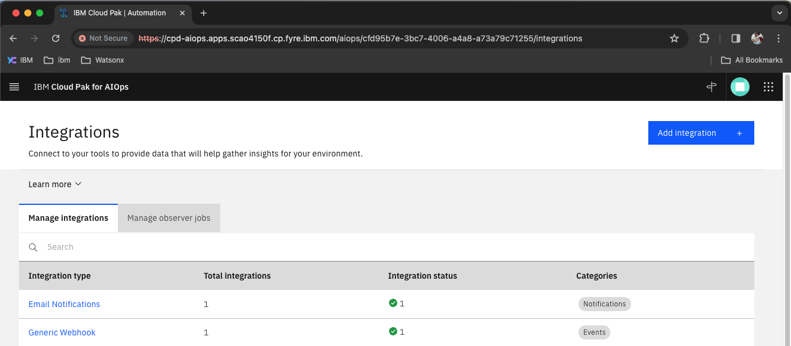
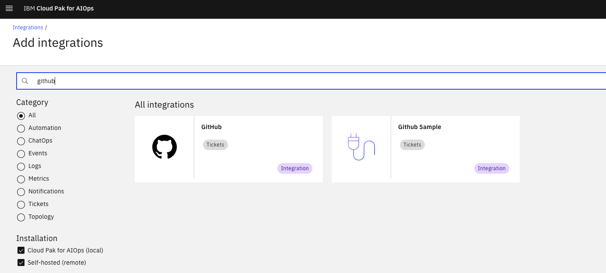
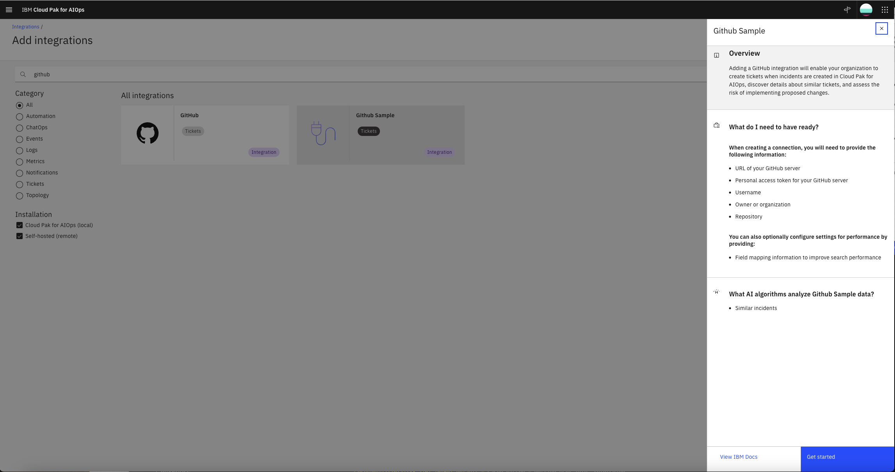
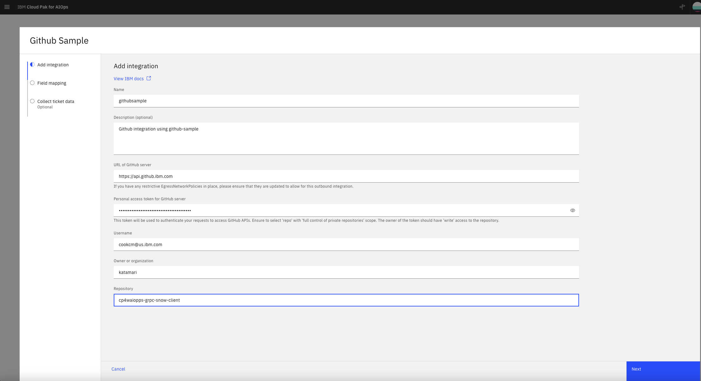
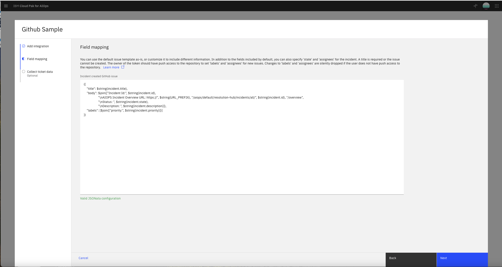
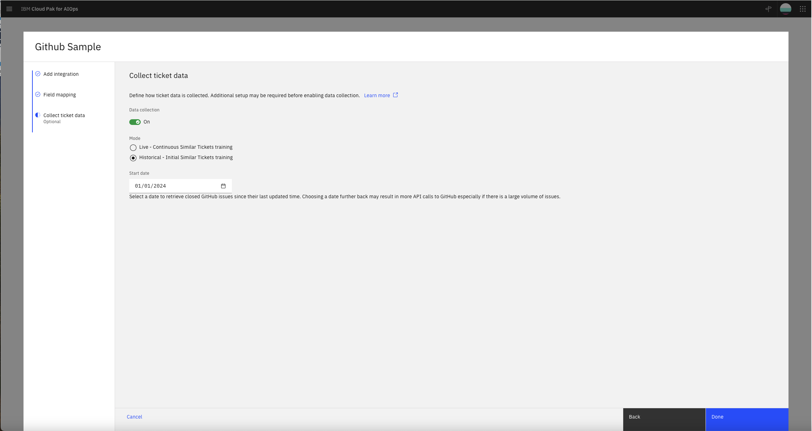
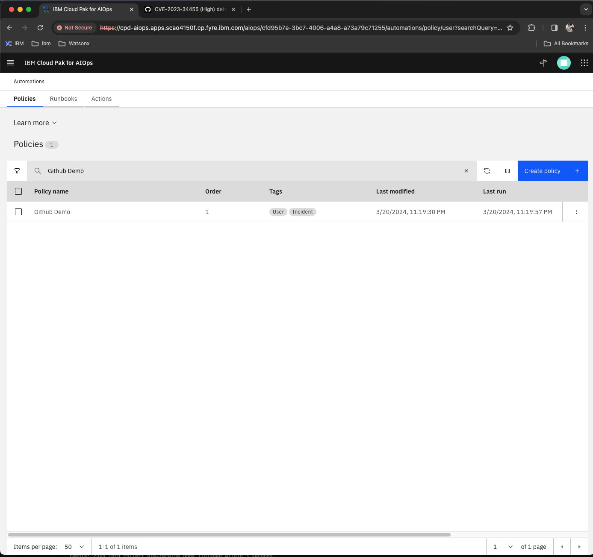
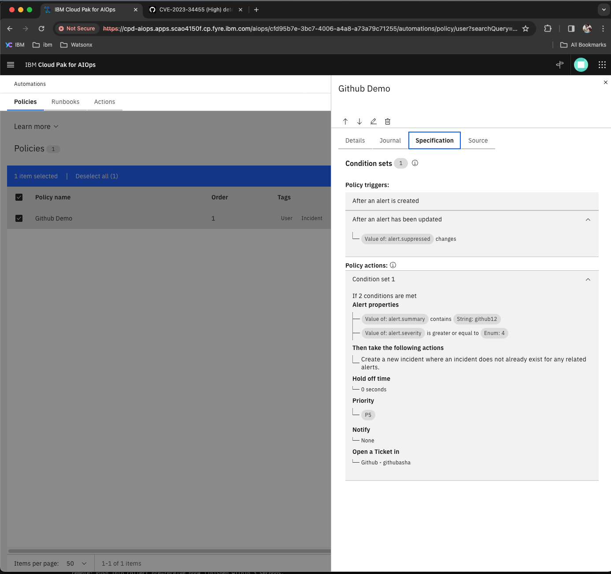
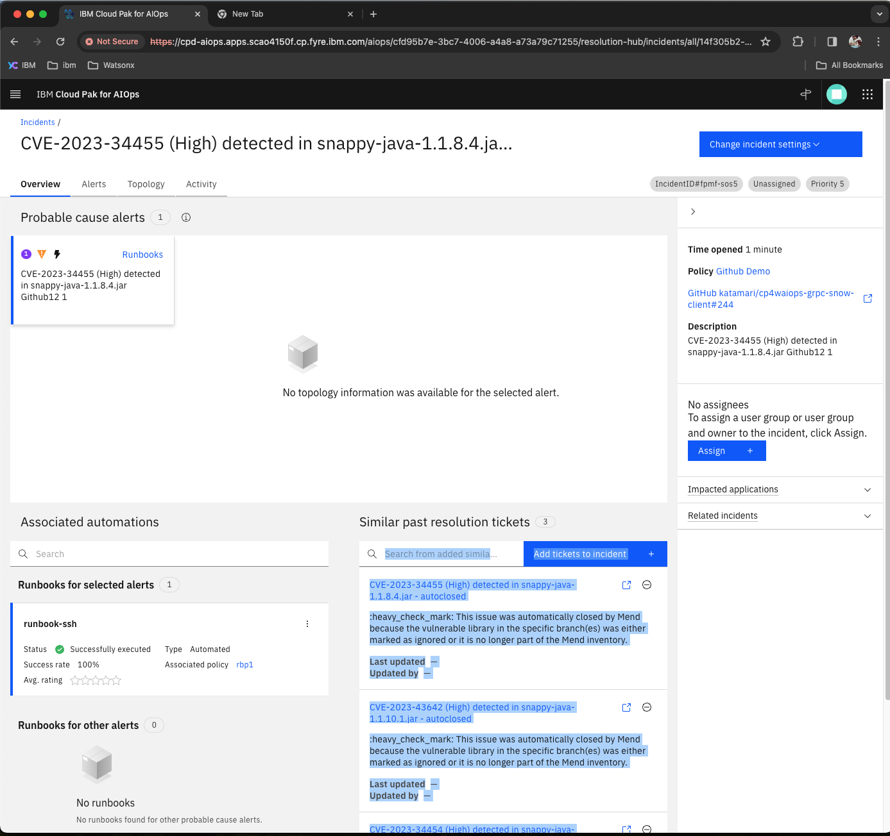
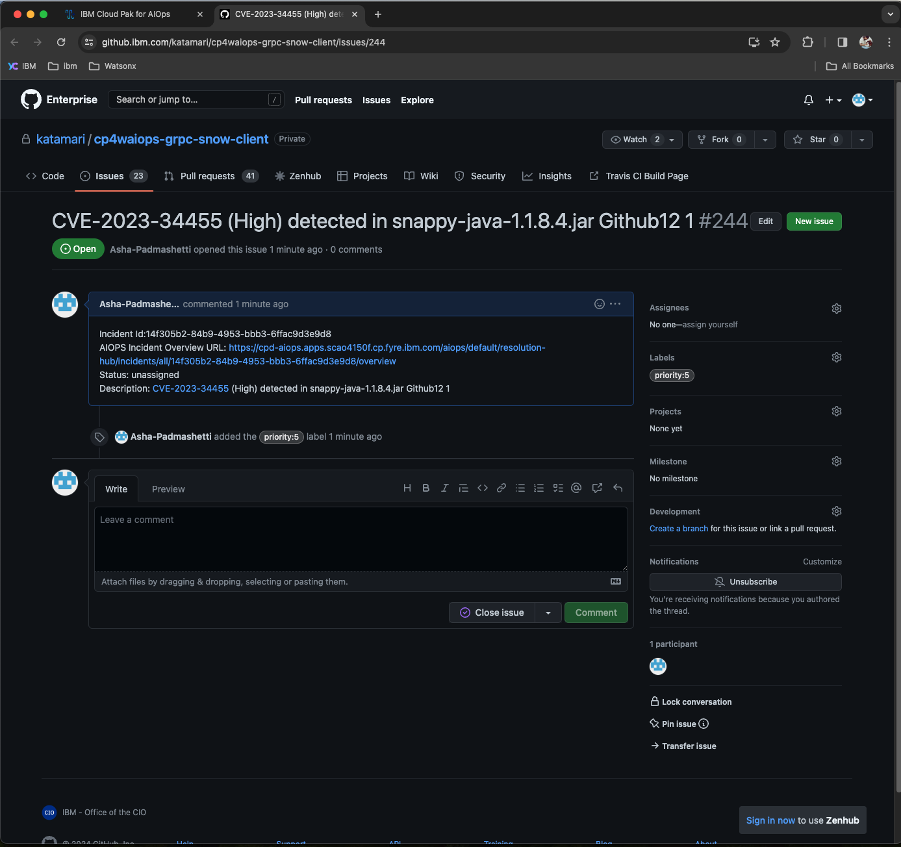

# Github Integration Template

## Testing
### Create The Github Integration

Search for `Github` to add your newly added integration.

You can fill in any valid data.

Press `Done`

`Running` indicates that it is configured properly
TODO: add an image with running

### Train the AI for Similar Incident and Change Risk
Go to the AI management page

Click on Similiar Incident. Go through the wizard with the defaults. Then precheck the data, train models, and deploy. There should be no errors.

### Policy Creation

To create a policy that will create an incident based on the classification, go to the automations page, click `Create policy`

Choose `Promote alerts to an incident`

Fill in the details and add github integration in the ticket section.

Click on Save button

Check if the specification have the added github integration

Make sure you set the event count increasing as a reason to generate an incident. Otherwise you need to modify the code to generate a new alert

## Incident Creation
Trigger Incident and see the details in incident details page

See the similar tickets in the past resolution tickets.

Click on the Github Link that mentioned in the right side box to see the Github issue.

